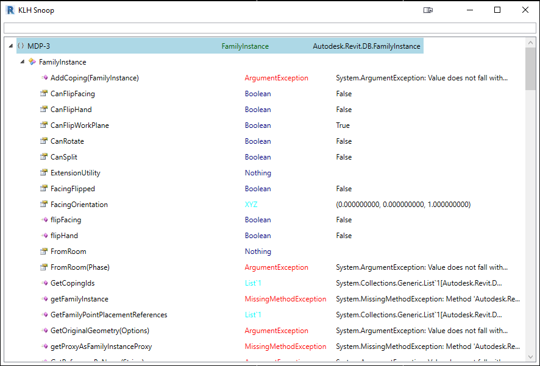

# KLH Revit Developer Tools
[](https://dev.azure.com/klhengineers/KLH/_build/latest?definitionId=18)
## KLHSnoop

Look at the object properties of elements. 

### Usage
Create a wrapping plugin and call the form like
```vb
Dim form As New DeveloperTools.KLHSnoop(commandData.Application.ActiveUIDocument)
form.Show()
```
or
```cs
var form = new DeveloperTools.KLHSnoop(commandData.Application.ActiveUIDocument);
form.Show();
```

### Features


KLH Snoop offers a number of features that its inspiration, [RevitLookup](https://github.com/jeremytammik/RevitLookup), doesn't have.

|Feature|RevitLookup|KLH Snoop|
|-------|:---------:|:-------:|
|Language|C#|VB.NET|
|UI Framework|WinForms|WPF|
|Dialog Type|Modal|Modeless|
|Ready to run <span title="RevitLookup can be installed as-is. KLH Snoop must be included in another tool.">ℹ️</span>|✔️|❌|
|Snoop Revit Elements|✔️|✔️|
|Snoop .NET Objects <span title="Anything you can see in KLH Snoop can be snooped, including native .NET objects like Exceptions.">ℹ️</span>|❌|✔️|
|See members of an IEnumerable <span title="Shown under 'Results' for any IEnumerable.">ℹ️</span>|✔️|✔️|
|Type Highlighting <span title="Structs, classes, elements, enums, and even exceptions are highlighted differently.">ℹ️</span>|✔️|✔️|
|Send to new window <span title="Right click any object in the tree to open it in a new modeless KLHSnoop window.">ℹ️</span>|✔️|✔️|
|Property Grouping <span title="Groups properties by thier derived class.">ℹ️</span>|✔️|✔️|
|Selection Parity <span title="If the UIDocument has elements in its selection when the tool is run, those elements are shown in the tool. Select elements in the tool to select them in the document.">ℹ️</span> |❌|✔️|
|Lazy Loading <span title="Double click an object in the form to load its data.">ℹ️</span> |❌|✔️|
|Copy Value <span title="Right click an object to copy its value as shown, or all of its value as a json object.">ℹ️</span>|❌|✔️|
|Add Elements By Ids <span title="Right click an empty part of the form to add elements to the tree using their comma separated ElementIds">ℹ️</span>|❌|✔️|
|Zoom <span title="Ctrl+Scroll to zoom in and out.">ℹ️</span>|❌|✔️|
|Pass in custom arguments <span title="Properties with ArgumentExceptions can be given an argument. Right click and Edit Parameters to pass in primitive types, ElementIds, Elements, or just a default object from a class' default constructor.">ℹ️</span>|❌|✔️|
|View Automation Tree <span title="See the properties of the window for writing automation tests using the Windows Automation library.">ℹ️</span>|❌|✔️|
